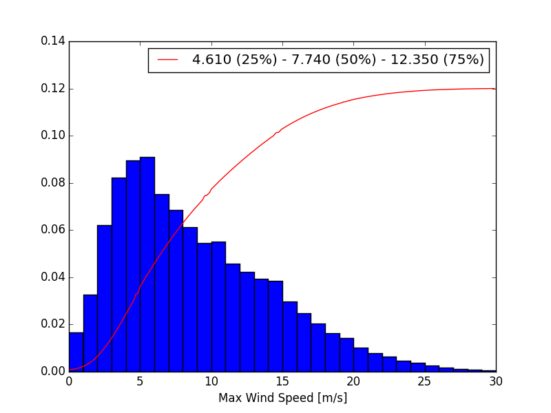
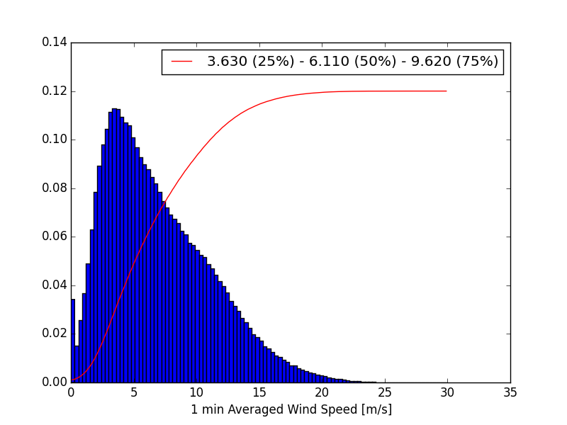

---
jupyter:
  jupytext:
    text_representation:
      extension: .Rmd
      format_name: rmarkdown
      format_version: '1.2'
      jupytext_version: 1.4.1
  kernelspec:
    display_name: Python 3
    language: python
    name: python3
---

# Atmospheric Fluctuations

Question 1.1.6 from referee to paper 1 is:
- We say we are not sensitive to modes larger than the distance between peaks (8.5 and 6.0 deg at 150 and 220 GHz)
- OK but what about smaller fluctuations ? Do they exist ? What do they cause ?

Zero-level answer:
- They would induce the same as for an imager: extra-noise
=> we added an answer in the text

Now it is interesting to investigate the actual scale of fluctuationss ? Is our statement at least valid for some of them or not ?

=> Discussion on Rocket Chat with Stefano Mandelli (Feb 17th 2021)

In Fourier Space (inverse time domain), the autocorrelation function of atmospheric fluctuations is:
$$ S(\omega) =\frac{1}{\sqrt{2\pi}} \int_{-\infty}^{+\infty} \langle T_A(t), T_A(t+\tau) \rangle \exp(-i\omega\tau),d\tau$$

$$ S(\omega) =\Phi\left(\frac{\omega}{v}\right) \times I\left(\frac{\omega}{v}\right)$$
where the first term is the instrinsic atmospheric fluctuations, and the second in the effect of the beam. So we can assume that our beam damps all scales larger than what corresponds to the distance between our peaks.

$\omega$ is the Fourier mode $2\pi f$ and $v$ is the wind speed.

$\Phi$ can be solved analytically for some extreme cases:

For High altitude atmoshpere $W(Z)>>L_0$:
$$\Phi\left(\frac{\omega}{v}\right) = \left\lbrace \begin{array}{c c} \left(\frac{\omega}{v}\right)^{-11/3} &\frac{1}{L_0}\ll\left(\frac{\omega}{v}\right)\ll \frac{1}{l_0} \\ const. & \frac{\omega}{v}\ll \frac{1}{L_0} \end{array} \right.$$

For low altitude atmsphere $W(Z) << L_0$:
$$\Phi\left(\frac{\omega}{v}\right) = \left\lbrace \begin{array}{c c} \left(\frac{\omega}{v}\right)^{-8/3} &\frac{1}{L_0}\ll\left(\frac{\omega}{v}\right)\ll \frac{1}{l_0} \\ const. & \frac{\omega}{v}\ll \frac{1}{L_0} \end{array} \right.$$

So a simpler way of saying this is:
$$\Phi\left(\frac{\omega}{v}\right) = \left\lbrace \begin{array}{c c} \left(\frac{\omega}{v}\right)^{\kappa} &\frac{1}{L_0}\ll\left(\frac{\omega}{v}\right)\ll \frac{1}{l_0} \\ const. & \frac{\omega}{v}\ll \frac{1}{L_0} \end{array} \right.$$
with $\kappa=-11/3$ at high altitude and $-8/3$ at low altitude.

$L_0$ is about 100m and $l_0$ is not clear...


### Wind speed
from the LLAMA data, we know the typical distribution of winds (all, max and 1min-averaged):
<table><tr>
<td> </td>
<td> </td>
<td> </td>
</tr></table>

So one can take a median wind of 7 m/sec

So we can rewrite things:
$$\Phi\left(\frac{\omega}{v}\right) = \left\lbrace \begin{array}{c c} \left(\frac{\omega}{v}\right)^{\kappa} &\frac{v}{L_0}\ll\omega\ll \frac{v}{l_0} \\ const. &\omega\ll \frac{v}{L_0} \end{array} \right.$$
with $\kappa=-11/3$ at high altitude and $-8/3$ at low altitude.


```{python}
atm_type = ['High Altitude', 'Low Altitude']
kappas = [-11./3, -8./3]
L0 = 100.
l0 = 0.
v = 7.


def phi(x, kappa=-11./3, L0=100., v=7.):
    high = x >= (v/L0)
    result = np.zeros_like(x)
    result[high] = (x[high]/v)**kappa
    result[~high] = result[high][0]
    return result

scan_speed = 1. #deg.sec

rc('figure',figsize=(12,8))

omegas = np.linspace(0, 100, 1000)
for i in range(len(kappas)):
    p=plot(omegas, phi(np.radians(omegas-scan_speed), kappa=kappas[i], L0=L0, v=v))
    plot(omegas, phi(np.radians(omegas+scan_speed), kappa=kappas[i], L0=L0, v=v), color=p[0].get_color())
    fill_between(omegas, phi(np.radians(omegas-scan_speed), kappa=kappas[i], L0=L0, v=v), 
                 y2=phi(np.radians(omegas+scan_speed), kappa=kappas[i], L0=L0, v=v), label=atm_type[i],
                color=p[0].get_color(), alpha=0.3)

legend()
xlabel('Atmospheric mode in Fourier Space $\omega$ [deg/sec]')
ylabel('$\Phi[\omega]$')
yscale('log')
xscale('log')
title('Region: +/- scan-speed')


```

```{python}
#### this is probably nonsense... need to think more...
altitudes = np.linspace(1,10000, 100)
w_v_150 = 8.5/altitudes
w_v_220 = 6.0/altitudes
p=plot(altitudes, (v-scan_speed)*w_v_150, color='r')
plot(altitudes, (v+scan_speed)*w_v_150, color=p[0].get_color())
fill_between(altitudes, (v-scan_speed)*w_v_150, y2=(v+scan_speed)*w_v_150, color=p[0].get_color(), 
             alpha=0.5, label='150 GHz')
p=plot(altitudes, (v-scan_speed)*w_v_220, color='b')
plot(altitudes, (v+scan_speed)*w_v_220, color=p[0].get_color())
fill_between(altitudes, (v-scan_speed)*w_v_220, y2=(v+scan_speed)*w_v_220, color=p[0].get_color(), 
             alpha=0.5, label='220 GHz')

yscale('log')
xscale('log')
ylabel('$\omega$ [deg/sec]')
xlabel('Altitude')
title('Synthesized Beam cutoff in Fourier Space (larger modes are cut)')
legend()
```

```{python}

```
